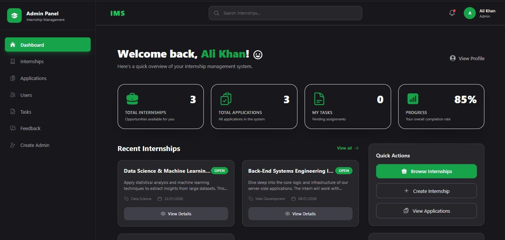

# 🎓 Internee.pk Virtual Internship Projects

This repository contains the projects I developed as part of my **Virtual Internship with [Internee.pk](https://internee.pk/)**.  
Each project is structured as a **full-stack MERN application** (React, Node.js, Express, MongoDB) and documented professionally, following the **Software Development Life Cycle (SDLC)** approach.

---

## 📂 Repository Structure

All projects follow a consistent structure with comprehensive documentation:

```
Internee.pk-Internship/
├── IMS/                                          # Internship Management System
│   ├── README.md                                 # Project overview
│   ├── frontend/                                 # React + Tailwind app
│   │   └── README.md                             # Frontend setup & features
│   └── backend/                                  # Node.js + Express API
│       └── README.md                             # Backend setup & APIs
│
├── Auto_Task_Reminder/                           # Task Reminder with Cron Jobs
│   ├── README.md                                 # Project overview
│   ├── client/                                   # React + Vite + Tailwind
│   │   └── README.md                             # Frontend documentation
│   └── server/                                   # Node.js + Express + MongoDB
│       └── README.md                             # Backend documentation
│
├── Collaborative_WorkSpace_Kanban_Style/         # Kanban Board Application
│   ├── README.md                                 # Project overview
│   ├── frontend/                                 # React + Redux + MUI + Drag & Drop
│   │   └── README.md                             # Frontend documentation
│   └── backend/                                  # Node.js + Express + MongoDB
│       └── README.md                             # Backend documentation
│
├── MERN_LMS_With_Paypal_Integration/             # Learning Management System
│   ├── README.md                                 # Project overview
│   ├── client/                                   # React + Vite + Tailwind + Radix UI
│   │   └── README.md                             # Frontend documentation
│   └── server/                                   # Node.js + Express + MongoDB
│       └── README.md                             # Backend documentation
│
└── Resume-Builder-MERN-resume_updated/           # Professional Resume Builder
    ├── README.md                                 # Project overview
    ├── client/                                   # React + Vite + MUI + Redux
    │   └── README.md                             # Frontend documentation
    └── server/                                   # Node.js + Express + MongoDB
        └── README.md                             # Backend documentation
```

---

## 🚀 Projects Overview

### 1. 📌 Internship Management System (IMS)


**Objective:** A comprehensive system to manage internship programs, track intern progress, and facilitate communication between admins and interns.

**Key Features:**
- **Admin Dashboard:** Manage internship programs, approve/reject applications, assign tasks, review submissions
- **Intern Dashboard:** Apply for internships, view tasks, submit work, track progress
- **Task Management:** Create tasks with deadlines, track completion
- **Performance Monitoring:** Real-time progress tracking and feedback system

**Tech Stack:** React, Tailwind CSS, Node.js, Express, MongoDB, JWT Authentication

**Documentation:**
- [📄 IMS Overview](./IMS/README.md)
- [🎨 Frontend README](./IMS/frontend/README.md)
- [⚙️ Backend README](./IMS/backend/README.md)

---

### 2. ⏰ Auto Task Reminder
**Objective:** A simple yet powerful MERN application for creating and managing task reminders based on date and time.

**Key Features:**
- Create and manage tasks with due dates
- Set task reminders with notifications
- Track task completion status
- Tag-based task organization
- CRUD operations with real-time updates
- Cron Jobs integration for scheduling

**Tech Stack:** React (Vite), Tailwind CSS, Node.js, Express, MongoDB, Axios

**Documentation:**
- [📄 Project Overview](./Auto_Task_Reminder/README.md)
- [🎨 Frontend README](./Auto_Task_Reminder/client/README.md)
- [⚙️ Backend README](./Auto_Task_Reminder/server/README.md)

---

### 3. 📊 Collaborative WorkSpace Kanban Style
**Objective:** A full-featured Kanban board application with drag-and-drop functionality for collaborative team task management.

**Key Features:**
- **Drag & Drop Board:** Intuitive task movement between sections
- **Section Management:** Create, update, and delete task columns
- **Real-time Updates:** Instant synchronization across team
- **Team Collaboration:** Assign tasks to team members
- **JWT Authentication:** Secure user authentication
- **Task Details:** Set due dates, priorities, and assignees

**Tech Stack:** React (CRA), Redux Toolkit, Material-UI, React DnD, Node.js, Express, MongoDB, JWT

**Documentation:**
- [📄 Project Overview](./Collaborative_WorkSpace_Kanban_Style/README.md)
- [🎨 Frontend README](./Collaborative_WorkSpace_Kanban_Style/frontend/README.md)
- [⚙️ Backend README](./Collaborative_WorkSpace_Kanban_Style/backend/README.md)

---

### 4. 🎓 MERN LMS with PayPal Integration
**Objective:** A complete Learning Management System enabling instructors to create and sell courses while students can purchase, learn, and track progress with integrated PayPal payments.

**Key Features:**
- **Course Management:** Instructors can create courses with multiple lectures
- **Video Streaming:** React Player for seamless video playback
- **Secure Payments:** PayPal integration for course purchases
- **Progress Tracking:** Visual progress indicators and completion tracking
- **Multiple Dashboards:** Role-based views for instructors and students
- **Media Upload:** Cloudinary integration for video and image hosting

**Tech Stack:** React 18 (Vite), Tailwind CSS, Radix UI, Redux, Node.js, Express, MongoDB, PayPal SDK, Cloudinary

**Documentation:**
- [📄 Project Overview](./MERN_LMS_With_Paypal_Integration/README.md)
- [🎨 Frontend README](./MERN_LMS_With_Paypal_Integration/client/README.md)
- [⚙️ Backend README](./MERN_LMS_With_Paypal_Integration/server/README.md)

---

### 5. 📝 Resume Builder MERN
**Objective:** A professional resume builder application that enables users to create, customize, and export resumes in multiple formats with beautiful pre-designed templates.

**Key Features:**
- **Multi-Step Resume Creation:** Guided form-based resume building
- **Multiple Templates:** 2+ professionally designed resume templates
- **Real-time Preview:** Live resume preview while editing
- **Export Options:** Download as PDF, DOCX, or print to PDF
- **Google Sign-In:** Firebase-based authentication
- **Data Persistence:** Redux Persist for automatic state saving

**Tech Stack:** React 18 (Vite), Material-UI, Redux Toolkit, Redux Persist, Firebase, jsPDF, html2canvas, Node.js, Express, MongoDB

**Documentation:**
- [📄 Project Overview](./Resume-Builder-MERN-resume_updated/README.md)
- [🎨 Frontend README](./Resume-Builder-MERN-resume_updated/client/README.md)
- [⚙️ Backend README](./Resume-Builder-MERN-resume_updated/server/README.md)


## ✅ SDLC Approach
Each project in this repository follows the **SDLC phases**:
1. **Requirements (SRS)** – Defining functional & non-functional requirements.  
2. **Design** – ERD, high-level architecture, and sequence diagrams.  
3. **Implementation** – Full MERN stack code.  
4. **Testing** – Manual/functional testing.  
5. **Final Documentation** – Scalability, reliability options, and reflections.  

---

## 📌 Future Projects
As part of this internship, more projects will be added here. Each will follow the same structure:
- **Project Overview (root README)**  
- **Frontend README**  
- **Backend README**  

---

## 🙏 Acknowledgment
These projects are developed during my **Virtual Internship with Internee.pk**, where the focus is on learning through **real-world, practical projects** and applying professional **software engineering practices**.  
